# what can you do with javascript
-----
## User Experiance
-----
### User Goals

*I need a website that shows me the simple possibilities of javascript so I can understand what is possible
*I need a website that gives me ideas for what I could make as a project so im not stuck thinking about what to make and wasting the users time

### Owner Goals

*I need a website that helps other people discover the creative possibilities of javascript so that I can help other people understand how incredible javascript is

-----
## Design

#### Colour
The colour will be consistent over all pages, i will use a turquois colour for the buttons and the ncontrast that against a tan background, i think these colours will give the site a fun and creative look as these colours are not used very often.

The typeography will be plain and simple, one that is easy to read and doesnt distract from what is being shown off, such as san-serif.

There will be no imported images as that is not what this website needs nor uses

### Wireframes

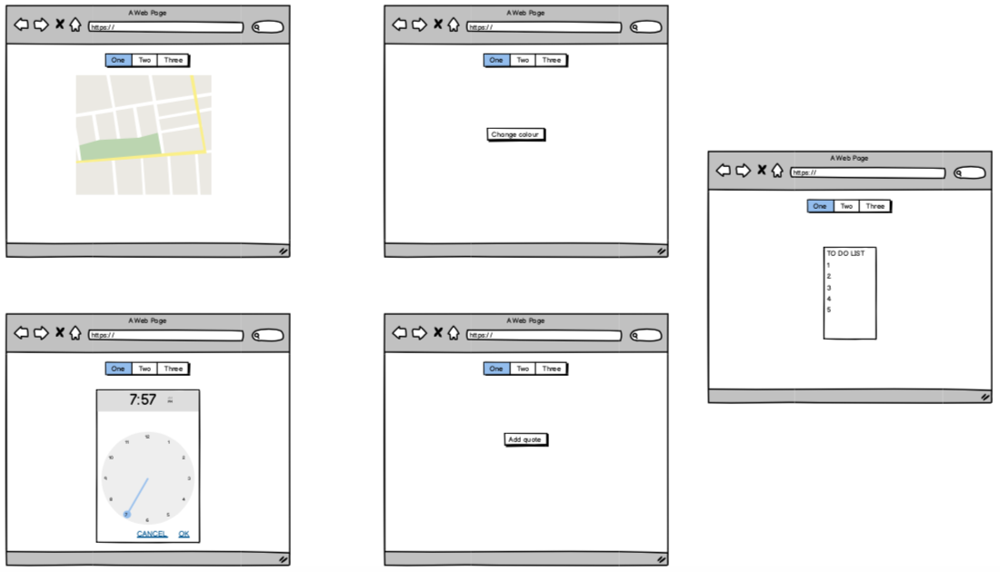

-----

## Technologies Used

* HTML 
* CSS
* Javascript
* google maps API
* gitHub
* gitPod
* gitHub Pages

------

## Testing

### Validators

#### HTML testing

Testing websites used:
* HTML: https://validator.w3.org/#validate_by_input
* CSS: https://jigsaw.w3.org/css-validator/#validate_by_input
* Javascript: https://javascriptvalidator.net/
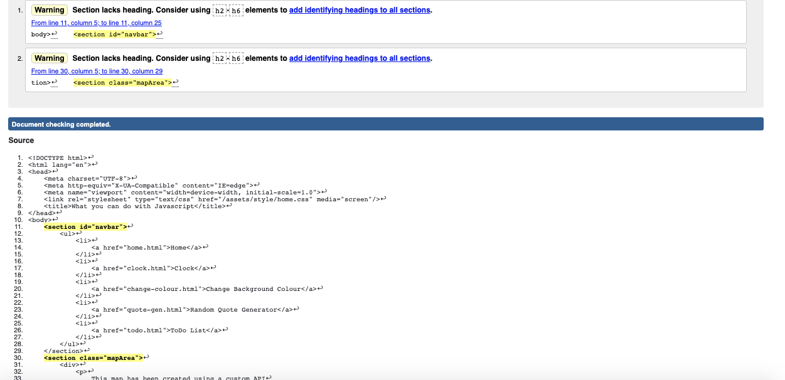

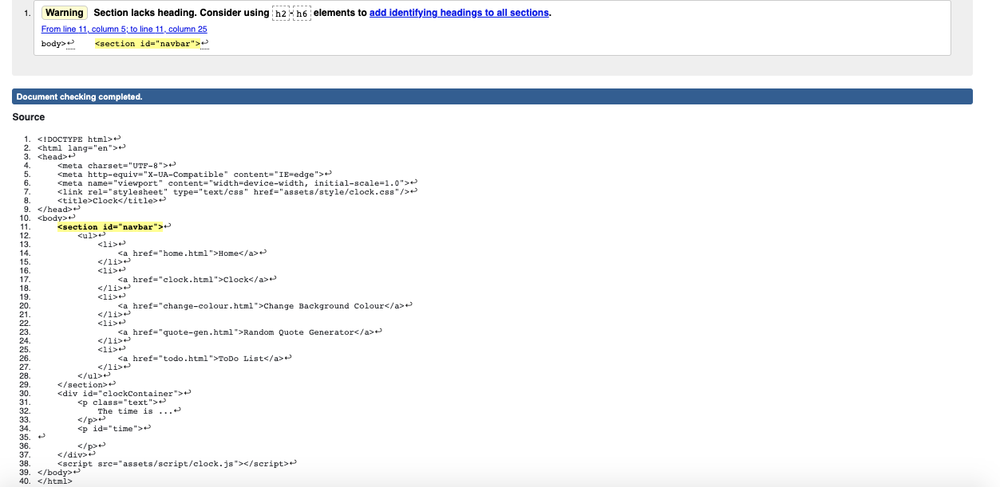

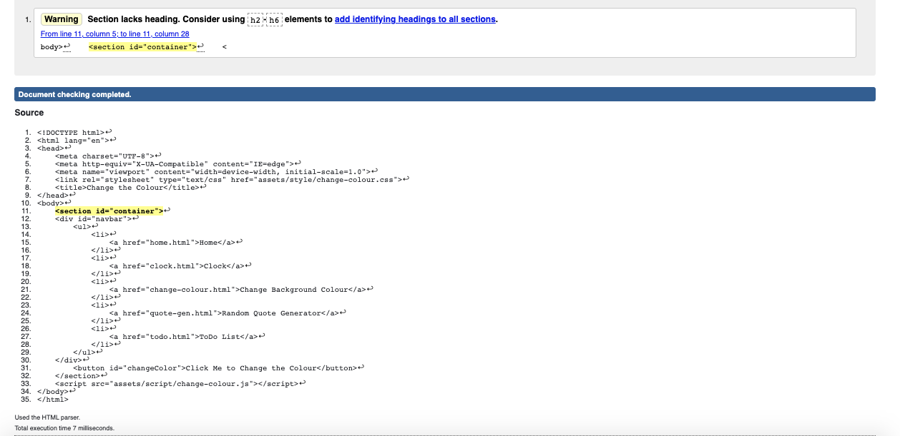

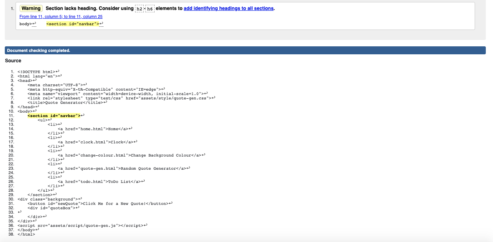

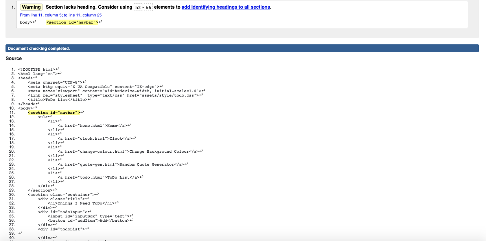

#### CSS testing

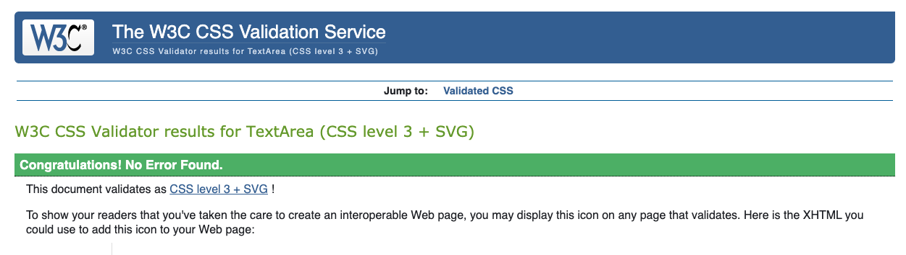

#### Javascript testing

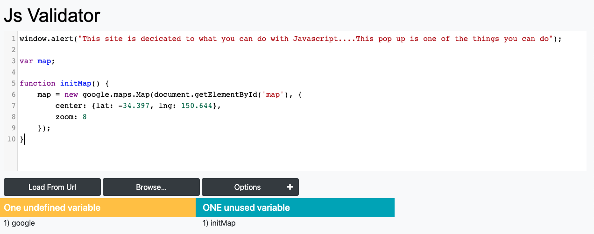

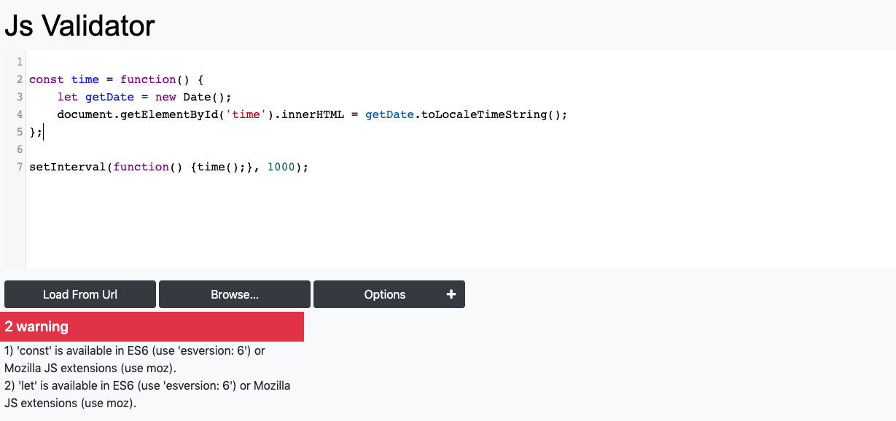

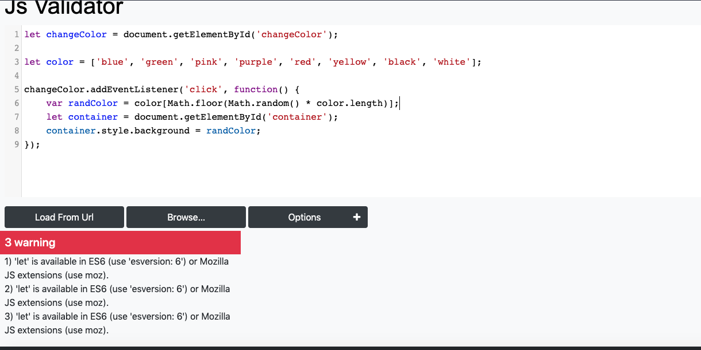

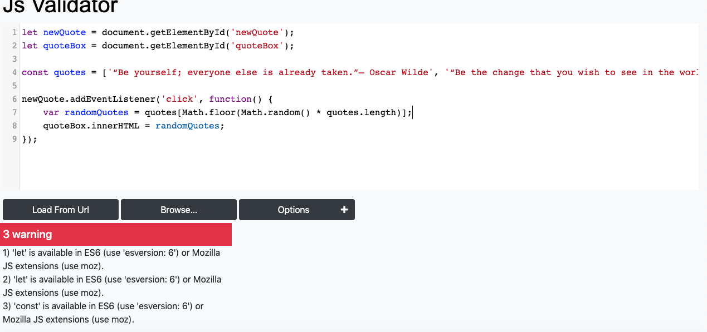

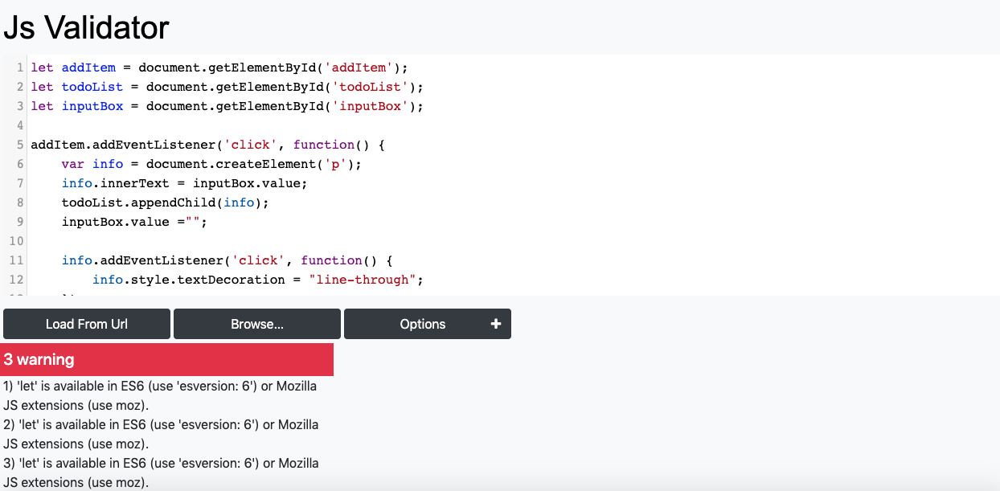

